# Type problems
A set of problems to improve your skills with `TyDD, Type Driven Development` 
in Java and some Functional libraries.

## Motivation

Using Java, the developers implements the solutions, transforming data 
with different nature. We will consider that data as `Values`. That values will be encapsulated into Objects. 
For the design of your values, you will use [Java primitives](https://docs.oracle.com/javase/tutorial/java/nutsandbolts/datatypes.html)
or [Java wrapper classes](https://en.wikipedia.org/wiki/Primitive_wrapper_class):

 

From Java 8, you can use `Monads`, a parameterized Types to wrap values into a context and apply functions on it. 
What Monads are available in Java 8+?

- [Stream< T >](https://docs.oracle.com/javase/8/docs/api/java/util/stream/Stream.html)
- [Optional< T >](https://docs.oracle.com/javase/8/docs/api/java/util/Optional.html)
- [CompletableFuture< T >](https://docs.oracle.com/javase/8/docs/api/java/util/concurrent/CompletableFuture.html)

Using third party libraries like VAVR, you could add new `Monads` like:

- [Try< T >](https://static.javadoc.io/io.vavr/vavr/0.9.2/io/vavr/control/Try.html)
- [Either< L ,R >](https://static.javadoc.io/io.vavr/vavr/0.9.2/io/vavr/control/Either.html)

Or you could use new ones from Reactor to model your Reactive problems:

- [Mono< T >](https://projectreactor.io/docs/core/release/api/reactor/core/publisher/Mono.html)
- [Flux< T >](https://projectreactor.io/docs/core/release/api/reactor/core/publisher/Flux.html)

The following problems was designed to improve your skills modeling solutions.

### Null safety

Java accept `null` when you assign a type `value` although is harmful. 
Using `JSR-305` meta-annotations like `@NonNull` or using `JSR 303` & `JSR 380` Bean validations,
you could indicate that your programs only accept Non null objects.

Enjoy the journey!

Juan Antonio Breña Moral


## Problems

Try to solve the problems using `Value Types` & `Monads`

### Problem 1

``` gherkin 
Feature: Insurance names

Background: Not everyone has a house in the Beach or acquire an Insurance for the house.

Scenario: Consume the solution in a Happy path scenario
    Given a TypeProblem1
    When  call the method: getInsuranceName()
    Then  return the name of the insurance

Scenario: Consume the solution when a Person without any Beachhosue
    Given a TypeProblem1
    When  call the method: getInsuranceName()
    Then  return the name of the default result

Scenario: Consume the solution when a Person without a Insurance
    Given a TypeProblem1
    When  call the method: getInsuranceName()
    Then  return the name of the default result

``` 



**Notes:** 

- Review the timeout for Every connection.
- If the Person doesn´t have a house in the beach or if he didn´t acquire an Insurance, return a default message: `NOT AVAILABLE`

## [References](./REFERENCES.md)