# Class diagram for Type problem 1

- https://mermaidjs.github.io/mermaid-live-editor

## Diagram:

```
classDiagram
      Person *-- "0..1" BeachHouse
      BeachHouse *-- "0..1" Insurance
      class Person {
          -BeachHouse house
          +BeachHouse getHouse()
      }
      class BeachHouse {
          -Insurance insurance
          +Insurance getInsurance()
      }
      class Insurance {
          -String name
          +String getName()
      }
      class Problem1 {
          +String getInsuranceName()
      }

```

## Visualization:



## Config:

```
{
  "theme": "forest"
}
```
